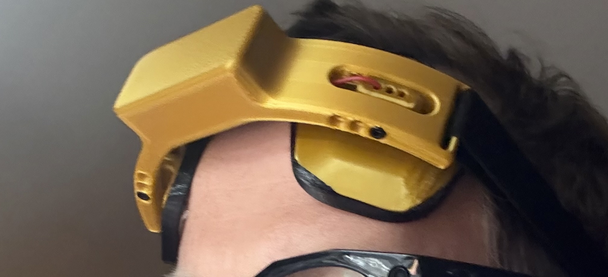
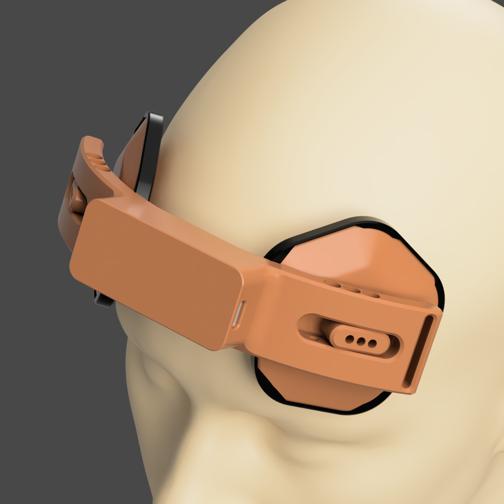
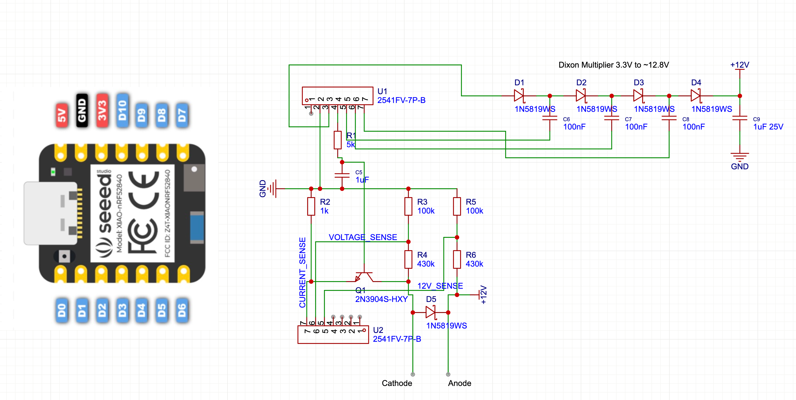
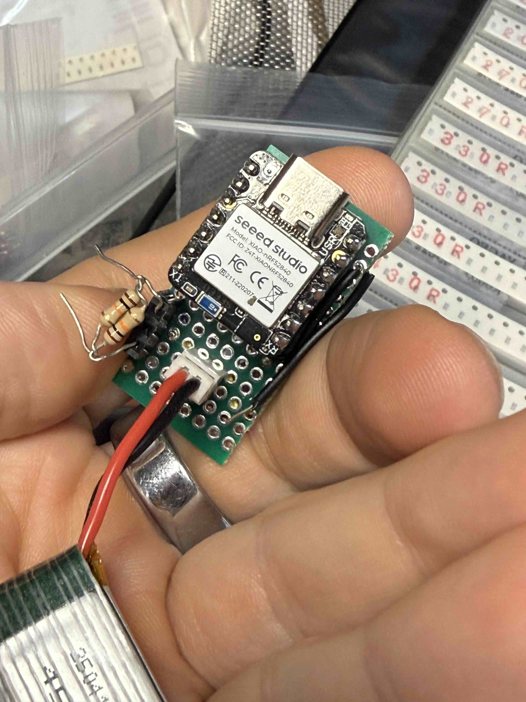
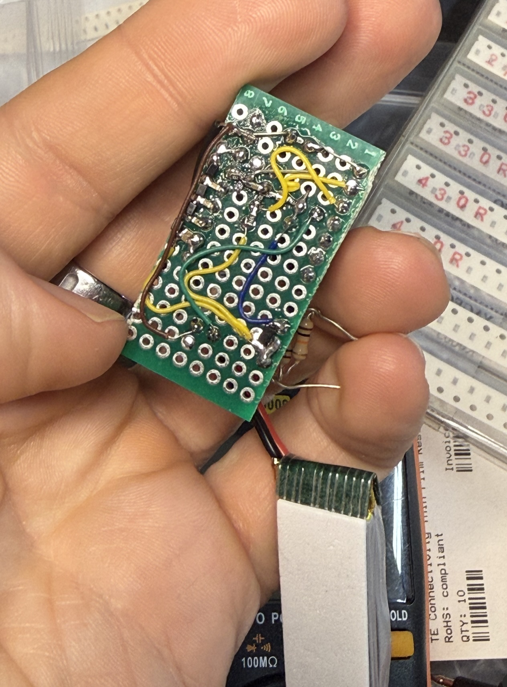

<!--
SPDX-License-Identifier: CC-BY-SA-4.0
Copyright (C) 2024-2026 Peter Kuhar and OpenTDCS Contributors
-->

# Open-tDCS-Stack

Open-source transcranial Direct Current Stimulation (tDCS) device using the Seeed Studio XIAO BLE nRF52840.

 

> Disclaimer: This is not a medical device. See `DISCLAIMER.md`.

## ⚠️ Safety Warning (tDCS / tES)

This open-source project is **not a certified medical device**. **Incorrect assembly, wiring, or electrode setup can cause dangerous current delivery**, leading to **skin burns/lesions**, unintended stimulation effects, equipment failure, or electric shock. tDCS/tES should only be performed with **medical-grade, certified equipment** and appropriate screening/supervision—**do not use DIY devices or unvalidated protocols on a person**.

### Sources
- IFCN (2015) "Transcranial electric stimulation in do-it-yourself applications" (PDF):  
  https://www.neurofyziologie.cz/doc/IFCNinfo/Using_tES_devices_as_DIY_FINAL_13Dec15.pdf
- Wurzman et al. (2016) "An open letter concerning do-it-yourself users of tDCS" (free full text, PMC):  
  https://pmc.ncbi.nlm.nih.gov/articles/PMC6050584/
- Fitz & Reiner (2015) "The challenge of crafting policy for do-it-yourself brain stimulation" (PubMed):  
  https://pubmed.ncbi.nlm.nih.gov/23733050/
- Bikson et al. (2016) "Safety of tDCS: Evidence-based update" (PubMed):  
  https://pubmed.ncbi.nlm.nih.gov/27372845/
- IFCN (Oct 2025) "Low intensity transcranial electric stimulation: Safety… guidelines 2017–2025 update" (PDF):  
  https://www.ifcn.info/UserFiles/file/CLINPH-S-25-01153_Targeted-Safety-Guidelines-update-Oct-2025.pdf
- Loo et al. (2011) "Avoiding skin burns with tDCS" (PubMed):  
  https://pubmed.ncbi.nlm.nih.gov/20923600/
- Rodríguez et al. (2014) "Skin lesions induced by tDCS" (PubMed):  
  https://pubmed.ncbi.nlm.nih.gov/25073936/
- "Skin Lesions Induced by tDCS" (PDF letter):  
  https://www.tmslab.org/publications/532.pdf
- Chao et al. (2018) "Hypomania induced by bifrontal tDCS" (free full text, PMC):  
  https://pmc.ncbi.nlm.nih.gov/articles/PMC6166027/

## Overview

Open-tDCS-Stack is a Bluetooth-enabled tDCS device that provides precise current control with real-time monitoring capabilities through a web interface.

## Hardware

- **Microcontroller**: Seeed Studio XIAO BLE nRF52840
- **Connectivity**: Bluetooth 5.0 (BLE)
- **Current Range**: 0-2.5mA (configurable)
- **Battery**: 3.7V LiPo

### Schematics 

 

### Printing 

Use a 3d printer. FDM is best, but resin should for with abs like resin for headband and electrodes and TPU like for the sponge retention. 

Print headband and electrodes in PLA or PETG and the sponge holder in TPU. Mine was printed on BambuLab P1S (PLA) and A1 Mini (TPU). 

## Firmware

The firmware is located in `firmware/build/opentdcs.ino.uf2`
To install on the XIAO BLE nRF52840. Place it into bootloader mode by quickly pressing the reset button twice. 
A XIAO USB drive will appear on your computer. Drag in the `firmware/build/opentdcs.ino.uf2` file. Done

(the UF2 file could be out of date. Please run `build.sh` in the `firmware` folder for an up to date build.)

### Features

- Real-time current monitoring and control
- Voltage monitoring: LiPo, compliance, output, electrode
- Electrode impedance calculation
- Configurable session parameters (duration, ramp up/down)
- BLE GATT service for wireless control
- Visual status indication via RGB LED
- Dickson charge pump voltage multiplier for 12V compliance voltage
- Test current (50µA) applied when connected but not in session

### Pin Usage

| Function | Pin | Description |
|----------|-----|-------------|
| PWM Output | D10 | Current control signal |
| Current Sense | A0 | Measures output current via 1kΩ sense resistor |
| Output Voltage | A1 | Output voltage monitoring (5.3x divider) |
| Compliance Voltage | A2 | 12V monitoring (5.3x divider) |
| LiPo ADC | P0.31 | LiPo battery voltage (AIN7, 2.96x divider) |
| LiPo Enable | P0.14 | Pull-down to enable LiPo voltage divider |
| Multiplier A1 | D9 | Dickson charge pump driver |
| Multiplier B | D8 | Dickson charge pump driver (inverted) |
| Multiplier A2 | D7 | Dickson charge pump driver |

### LED Status

| State | Color | Pattern |
|-------|-------|---------|
| Idle/Advertising | Green | Blink (50ms every 4s) |
| Connected | Blue | Solid |
| Session Active | Red | Solid |

## Web Interface

TLDR: Web UI is hosted at https://unrelatedlabs.github.io/Open-tDCS-Stack/gui/

The web GUI is located in `gui/index.html` and provides:

- Device connection via Web Bluetooth API
- Session control and monitoring
- Real-time current and impedance graphs
- Session history tracking

### Readings Display

**Primary (large):**
- I set / I measured (mA)
- V electrode (compliance - output voltage)
- R electrode (kΩ impedance)

**Secondary (small):**
- V lipo (battery)
- V compliance (Dickson output)
- V output

### Usage

1. Open in Web Bluetooth-compatible browser (Chrome, Edge). On iOS use the V Browser https://apps.apple.com/us/app/the-v-browser/id6446792641
2. Click "Connect Device" and select your tDCS device
3. Configure session parameters (current, duration, ramp time)
4. Start session and monitor real-time data

## Safety Notes

- This is an experimental device for research purposes only
- Always follow proper tDCS safety protocols
- Maximum current is limited to 4mA in hardware.
- Device includes impedance monitoring for electrode contact quality
- Automatic session termination on completion

Read the full disclaimer in `DISCLAIMER.md` before use.

## License

This project uses a multi-license approach:

| Component | License | SPDX Identifier |
|-----------|---------|-----------------|
| Hardware designs (schematics, 3D models) | [CERN-OHL-S-2.0](LICENSES/CERN-OHL-S-2.0.txt) | `CERN-OHL-S-2.0` |
| Software & firmware | [GPL-3.0](LICENSES/GPL-3.0.txt) | `GPL-3.0-or-later` |
| Documentation | [CC-BY-SA-4.0](LICENSES/CC-BY-SA-4.0.txt) | `CC-BY-SA-4.0` |

See [LICENSE](LICENSE) for full details.

## References

- [Seeed Studio XIAO BLE Documentation](https://wiki.seeedstudio.com/XIAO_BLE/)
 
